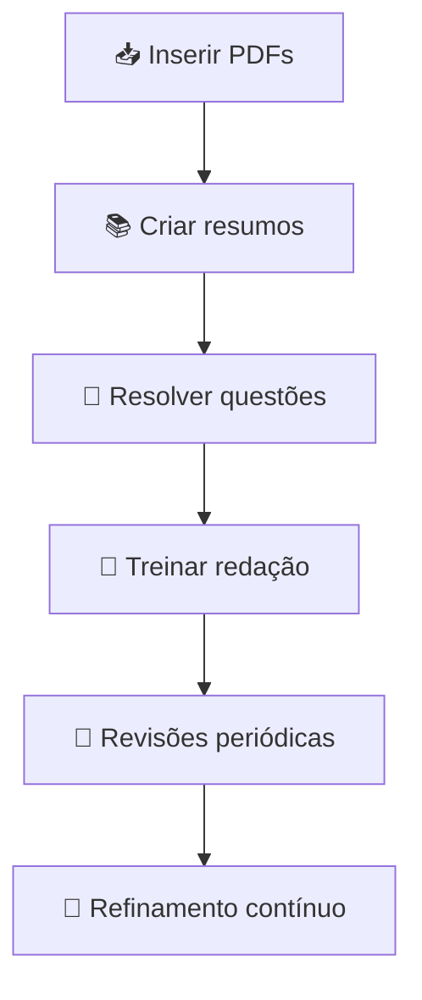

# 📚 Guia de Estudos — SEDES DF 2026  
### 🎯 Técnico em Assistência Social — Técnico Administrativo  

  
  
  
  

---

## 🧭 Sobre o Projeto
Este repositório funciona como um **caderno de estudos estruturado** para o concurso da **SEDES-DF 2026**, com foco no cargo de **Técnico em Assistência Social – Técnico Administrativo**.

A proposta é unir:
- 📖 Conteúdo organizado  
- 🧠 Estratégias de aprendizado  
- 🤖 Uso de IA (engenharia de prompts)  
- 📊 Evolução contínua  

---

## 🎯 Objetivos de Estudo

| Objetivo | Descrição |
|----------|----------|
| 📌 Domínio do conteúdo | Cobrir todo o edital com foco nos temas mais cobrados |
| 📚 Organização | Centralizar materiais e resumos em um só lugar |
| 🧠 Aprendizado ativo | Priorizar questões e revisões |
| ✍️ Redação | Desenvolver prática constante |
| 🤖 IA aplicada | Melhorar estudos com prompts estratégicos |

---

## 📖 Curadoria de Fontes

| Fonte | Tipo | Status |
|------|------|--------|
| 📄 Fonte 1 | PDF | ⏳ Pendente |
| 📄 Fonte 2 | PDF | ⏳ Pendente |
| 📄 Fonte 3 | PDF | ⏳ Pendente |

> 🔎 Critérios: relevância, confiabilidade e aderência ao edital

---

## 🧠 Engenharia de Prompts

### 📌 Prompt Inicial
> Como devo me preparar para esse concurso?

---

### ✅ Principais Insights
- 📘 Priorizar:
  - LOAS → PNAS → SUAS  
- 📖 Foco em **lei seca**  
- 📝 Treinar redação desde o início  
- 🧩 Resolver muitas questões  
- 📚 Estudar Português e LODF  

---

### ⚙️ Estratégia Definida

| Etapa | Ação |
|------|------|
| 1️⃣ Base | LOAS → PNAS → SUAS |
| 2️⃣ Apoio | Português + LODF |
| 3️⃣ Prática | Questões + simulados |
| 4️⃣ Diferencial | Redação semanal |

---

### ⚠️ Cicatrizes (Aprendizados)
- ❌ Prompts genéricos geram respostas genéricas  
- ❌ Falta de contexto reduz qualidade da resposta  
- ✅ Refinar perguntas melhora drasticamente o resultado  

---

### 🔧 Exemplo de Melhoria de Prompt

| Tipo | Prompt |
|------|--------|
| ❌ Genérico | Como estudar para concurso? |
| ✅ Otimizado | Monte um plano de estudos para SEDES-DF (Técnico Administrativo), incluindo prova objetiva e redação |

---

## 🗺️ Roadmap de Evolução

## 📊 Progresso

| Etapa | Status |
|------|--------|
| 📥 Upload de materiais | ⏳ Em andamento |
| 📚 Resumos | ⏳ Em andamento |
| 🧩 Questões | ⏳ Em andamento |
| 📝 Redação | ⏳ Em andamento |
| 🔁 Revisões | ⏳ Em andamento |

---

## 🚀 Próximos Passos

- [ ] Adicionar PDFs das fontes  
- [ ] Criar resumos por disciplina  
- [ ] Inserir questões comentadas  
- [ ] Criar banco de redações  
- [ ] Atualizar progresso semanal  

---

## 💡 Diferencial do Projeto

Este repositório vai além de um simples material de estudo — ele demonstra:
- 📂 Organização  
- 🧠 Pensamento estratégico  
- 🤖 Uso inteligente de IA  
- 📈 Evolução contínua  
